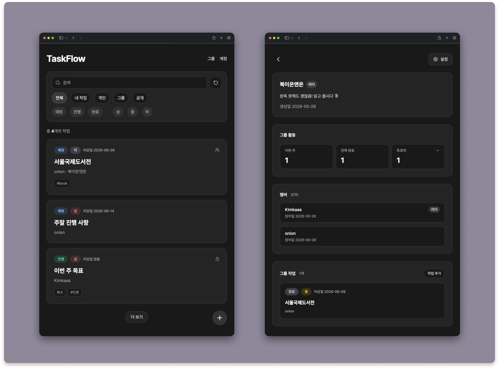
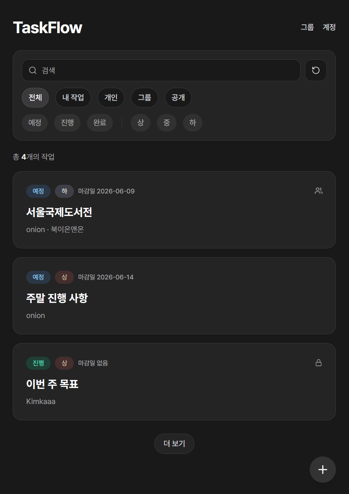
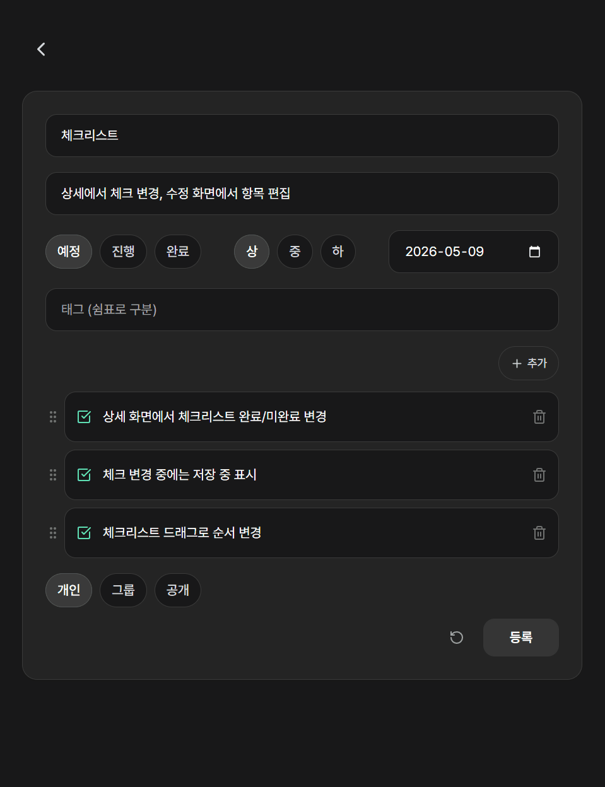
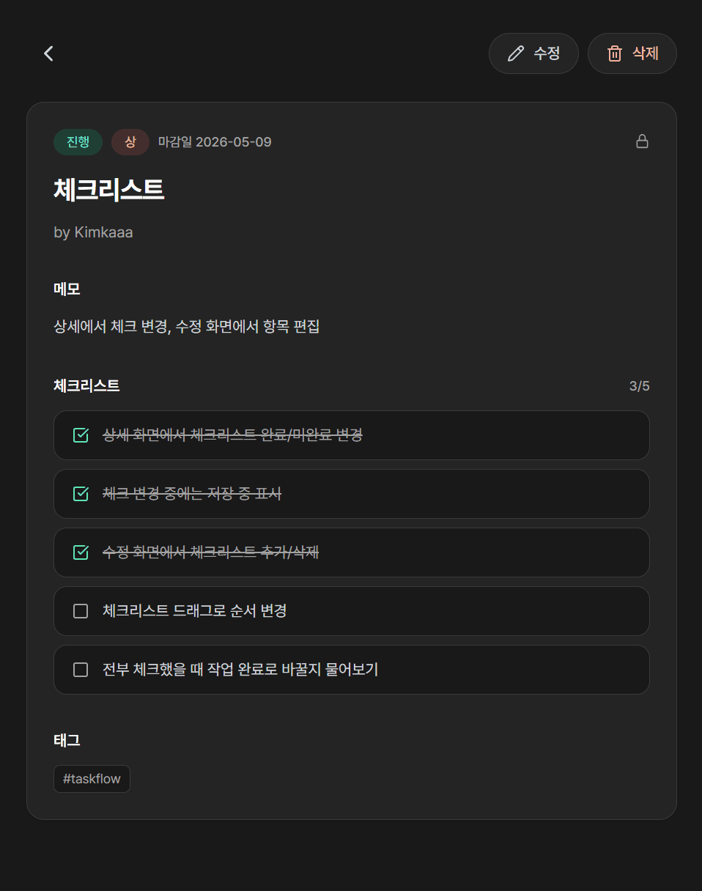
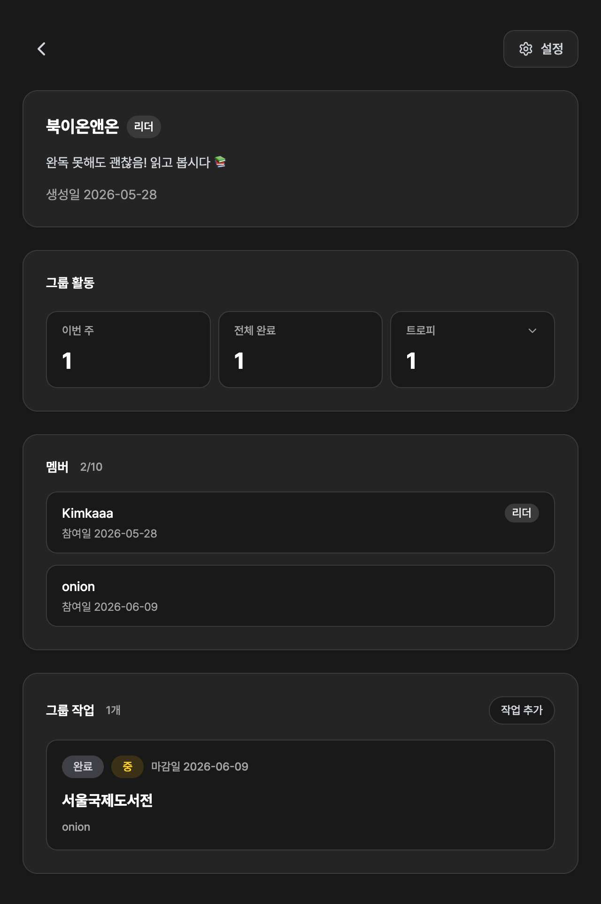
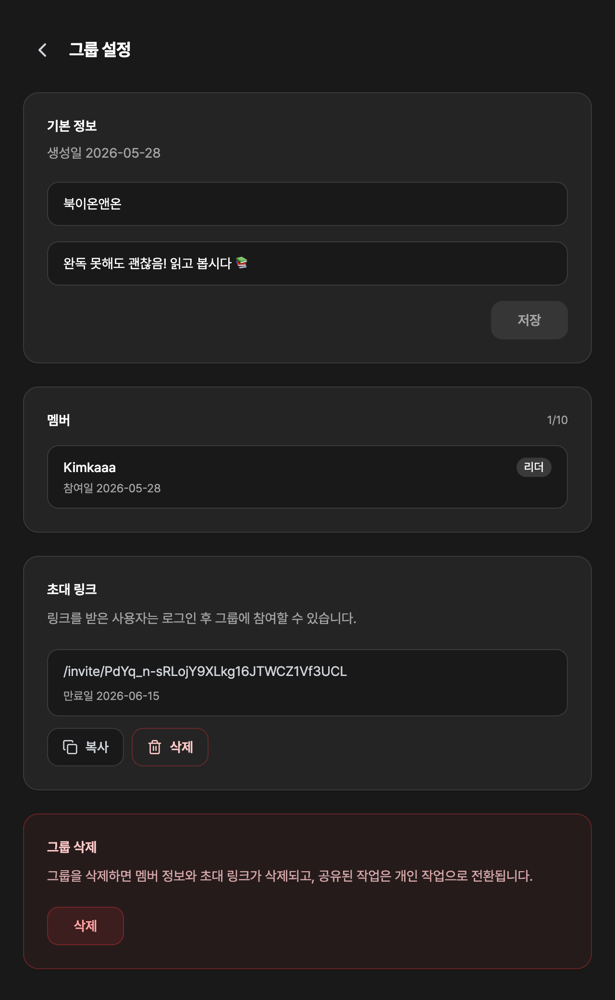
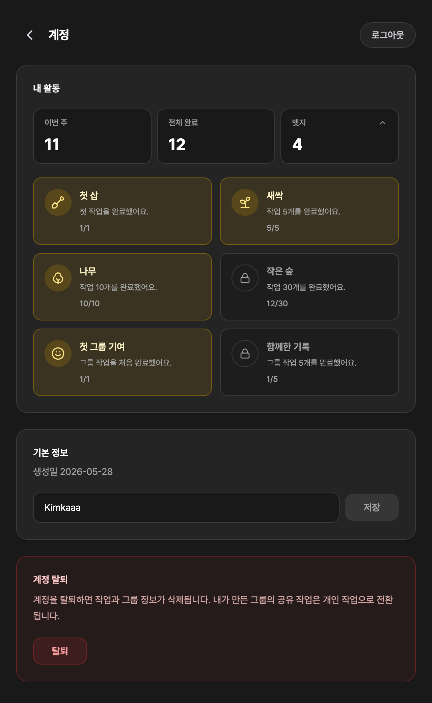

# TaskFlow

 

TaskFlow는 개인 작업을 정리하고 관리하기 위해 만든 서비스입니다.

Next.js와 TypeScript로 구현했으며, Supabase를 통해 인증과 데이터베이스를 연동하고 Vercel에 배포했습니다.

 
 

## 프로젝트 정보

- **유형**: 개인 프로젝트

- **기간**: 2026.05.06 ~ 2026.06.11

- **배포 링크**: 🔗 [https://taskflow-ten-eosin.vercel.app](https://taskflow-ten-eosin.vercel.app/)

 
 

## 기술 스택

- **프론트엔드**: TypeScript, Next.js, React, Tailwind CSS

- **인증**: Supabase Auth, GitHub OAuth

- **데이터베이스**: Supabase PostgreSQL

- **ORM**: Prisma

- **배포**: Vercel

 
 

## 주요 기능

- GitHub 로그인

- 작업 등록/수정/삭제

- 체크리스트 관리

- 그룹 관리, 작업 공유, 초대 링크 관리

- 계정 관리

 
 

## 주요 화면

### 작업 목록

검색, 필터를 통해 개인/그룹/공개 작업을 조회할 수 있습니다.

 

### 작업 등록

작업 정보와 체크리스트를 입력하고, 그룹 작업으로 공유할 수 있습니다.

 

### 작업 상세

작업 내용을 확인하고, 체크리스트 완료 여부를 변경할 수 있습니다.

 

### 그룹 상세

그룹 활동, 멤버, 공유된 그룹 작업을 확인할 수 있습니다.

 

### 그룹 설정

그룹 정보를 수정하고, 초대 링크를 생성해 멤버를 초대할 수 있습니다.

 

### 계정

활동 기록과 뱃지를 확인하고, 계정을 관리할 수 있습니다.

 
 

## 구현 내용

### 목록 조회 및 로딩 UX

배포 환경에서 목록 조회 응답이 지연되는 문제를 확인하고, 조회 방식과 로딩 피드백을 보완했습니다.

목록 화면에 필요한 필드만 `select`로 조회하고, Prisma `orderBy`와 `cursor` 기반 페이지네이션으로 초기 조회 범위를 제한했습니다.

요청이 발생하는 화면 요소에는 로딩 UI와 pending 상태를 표시해, 지연 상황에서 사용자가 처리 중임을 알 수 있도록 했습니다.

 

### Server Actions 기반 데이터 저장

작업 등록과 수정은 Next.js Server Actions로 처리했습니다.

기본 정보, 체크리스트, 태그를 함께 저장하기 위해 Prisma 트랜잭션을 사용했습니다.

태그는 기존 데이터를 재사용해 동일 태그가 중복 저장되지 않도록 했습니다.

입력 단계와 서버 액션에서 입력값을 검증하고, 예외 발생 시 화면에서 안내할 수 있도록 했습니다.

 

### GitHub OAuth 인증

Supabase Auth를 사용해 GitHub 로그인을 연동했습니다.

로그인 전 요청 경로를 `next` 값으로 전달하고, OAuth 콜백 이후 해당 경로로 이동하도록 했습니다.

`next` 값을 검증해 의도하지 않은 경로로 이동하지 않도록 제한했습니다.

 

### 체크리스트 관리

작업마다 체크리스트를 등록하고, 상세 화면에서 완료 여부를 변경할 수 있도록 했습니다.

입력 화면에서 항목을 편집하고, `dnd-kit`을 사용해 드래그 앤 드롭으로 순서를 변경할 수 있도록 했습니다.

변경된 순서는 `sortOrder`로 저장해, 저장 후에도 순서가 유지되도록 했습니다.

 

### 그룹 기능과 멤버 초대

작업 공개 범위를 개인/그룹/공개로 구분했습니다.

- 개인: 비공개

- 그룹: 그룹 멤버 공개

- 공개: 전체 공개

그룹을 생성해 멤버들이 작업을 공유하고, 이번 주 완료 현황과 트로피를 확인할 수 있도록 했습니다.

그룹 정보 수정과 초대 링크 기반 멤버 초대 기능을 제공했습니다.

그룹 삭제나 탈퇴 시 공유된 그룹 작업은 개인 작업으로 전환되도록 처리했습니다.