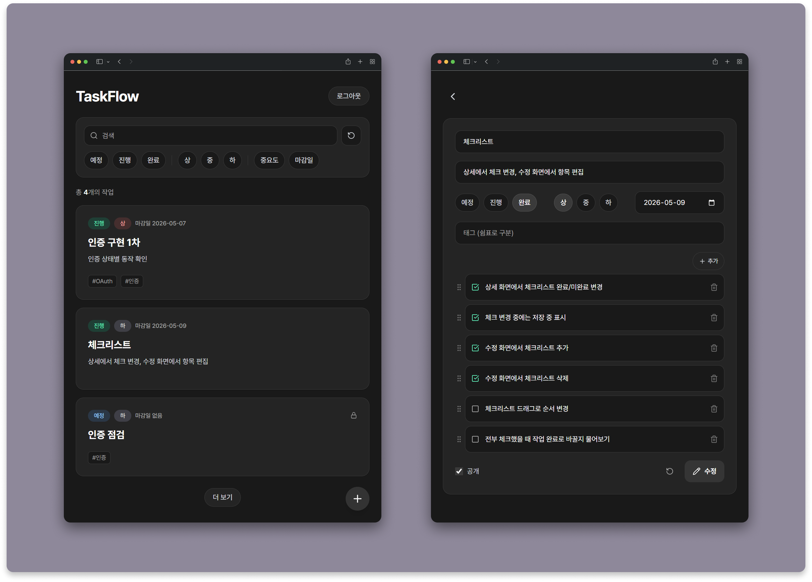
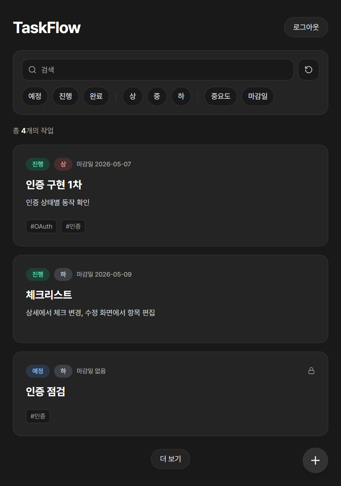
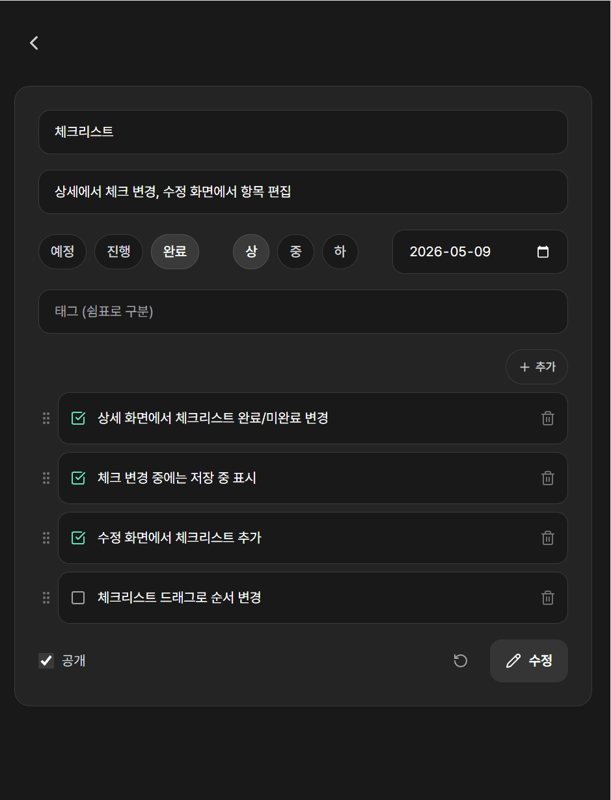
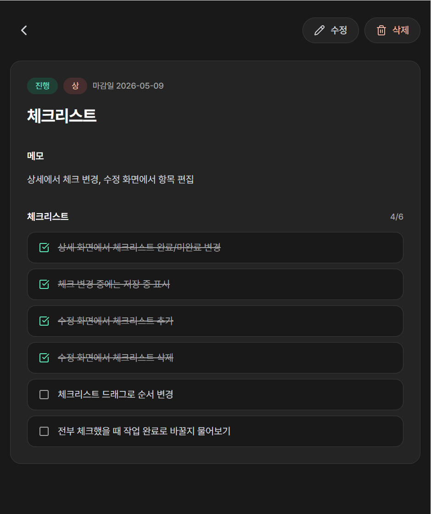

# TaskFlow

 

TaskFlow는 개인 작업을 정리하고 관리하기 위해 만든 서비스입니다.

Next.js와 TypeScript로 구현했으며, Supabase를 통해 인증과 데이터베이스를 연동하고 Vercel에 배포했습니다.

 
 

## 프로젝트 정보

- **유형**: 개인 프로젝트

- **기간**: 2026.05.06 ~ 2026.05.11

- **배포 링크**: 🔗 [https://taskflow-ten-eosin.vercel.app](https://taskflow-ten-eosin.vercel.app/)

 
 

## 기술 스택

- **프론트엔드**: TypeScript, Next.js, React, Tailwind CSS

- **인증**: Supabase Auth, GitHub OAuth

- **데이터베이스**: Supabase PostgreSQL

- **ORM**: Prisma

- **배포**: Vercel

 
 

## 주요 기능

- GitHub 로그인

- 작업 등록/수정/삭제

- 상태, 중요도, 마감일, 공개 여부 설정

- 검색, 필터링, 정렬

- 체크리스트 기반 세부 작업 관리

 
 

## 주요 화면

### 작업 목록

검색, 태그, 필터, 정렬 조건에 따라 작업을 확인할 수 있습니다.

 

### 작업 수정

작업 기본 정보와 태그, 체크리스트를 수정할 수 있습니다.

 

### 작업 상세

작업 내용과 체크리스트를 확인하고, 항목별 완료 여부를 변경할 수 있습니다.

 
 

## 구현 내용

### GitHub OAuth 인증

Supabase Auth를 사용해 GitHub 로그인을 연동했습니다.

로그인 전 요청 경로를 `next` 값으로 전달하고, OAuth 콜백 이후 해당 경로로 이동하도록 했습니다.

권한이 필요한 서버 액션에서는 현재 사용자와 작업 소유자를 비교한 뒤 처리했습니다.

 

### Server Actions 기반 데이터 저장

작업 등록과 수정은 Next.js Server Actions로 처리했습니다.

기본 정보, 체크리스트, 태그를 함께 저장하기 위해 Prisma 트랜잭션을 사용했습니다.

입력 단계와 서버 액션에서 입력값을 검증하도록 했습니다.

 

### 조건 기반 목록 조회

작업 목록은 검색, 필터, 정렬 조건에 따라 조회하고, `#태그명` 검색어는 태그 조회로 처리했습니다.

초기 목록은 서버에서 조회하고, 추가 데이터는 API Route에서 현재 조건과 cursor 값을 기준으로 조회했습니다.

 

### 체크리스트 관리

작업마다 체크리스트를 등록하고, 상세 화면에서 완료 여부를 변경할 수 있도록 했습니다.

입력 화면에서 항목을 편집하고, 드래그 앤 드롭으로 순서를 변경할 수 있도록 했습니다.
